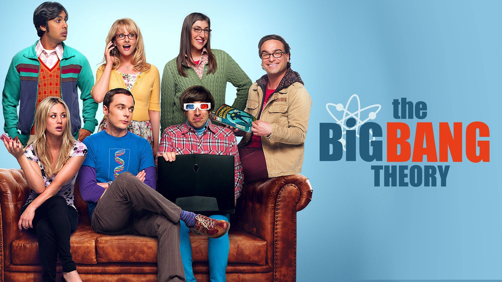
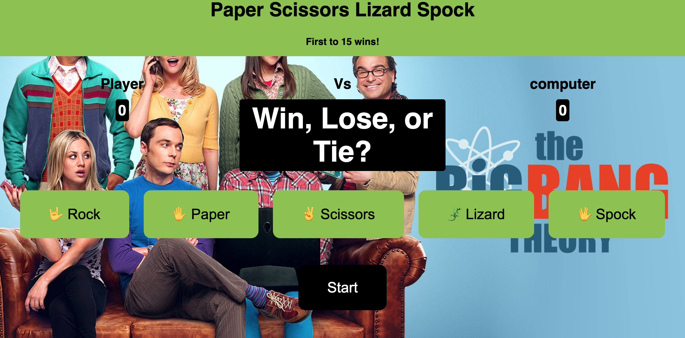
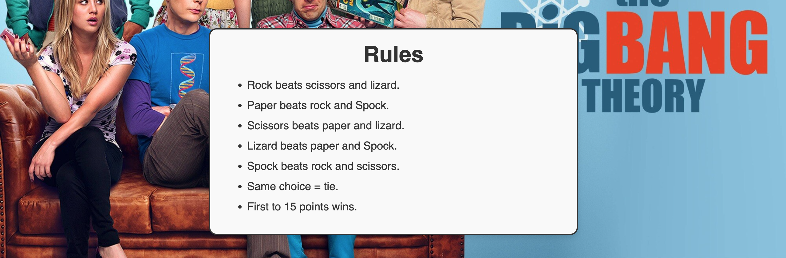
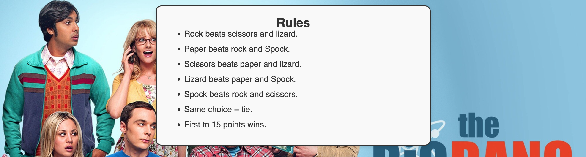
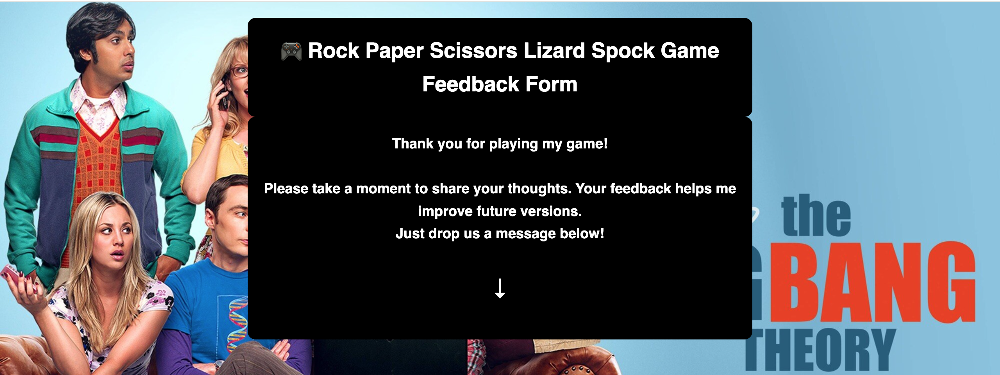
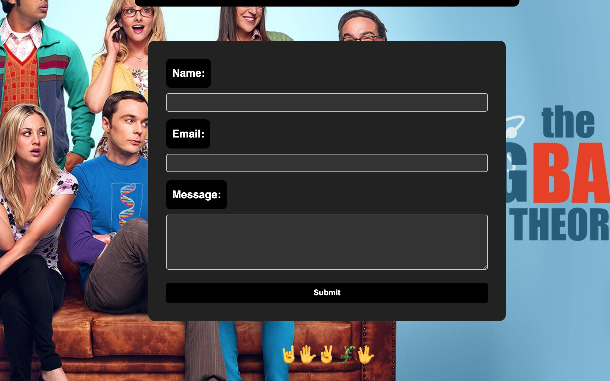
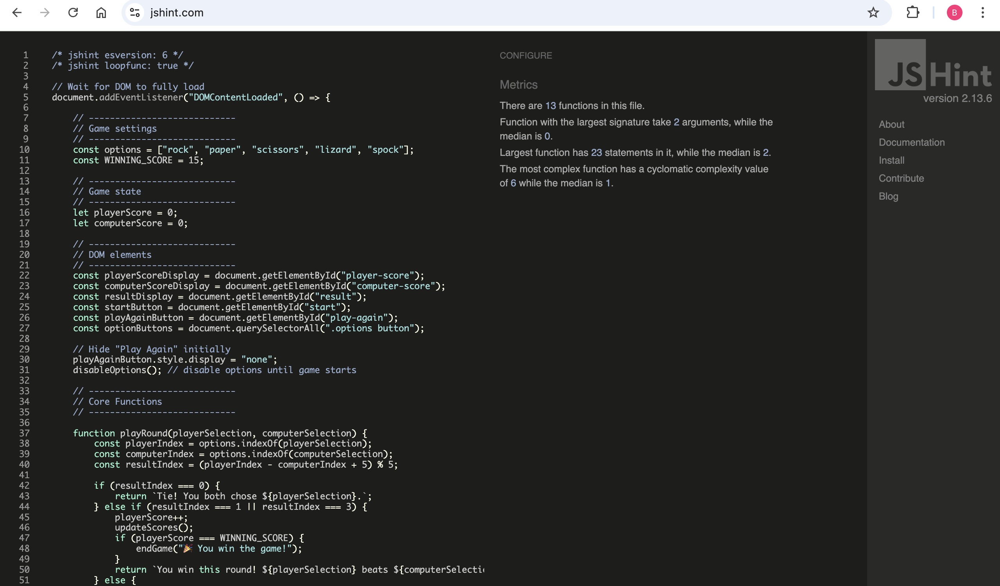
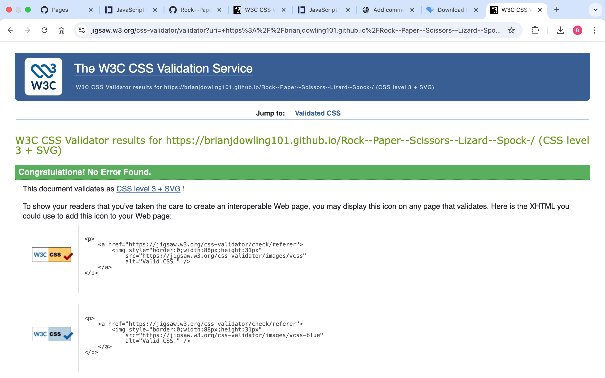
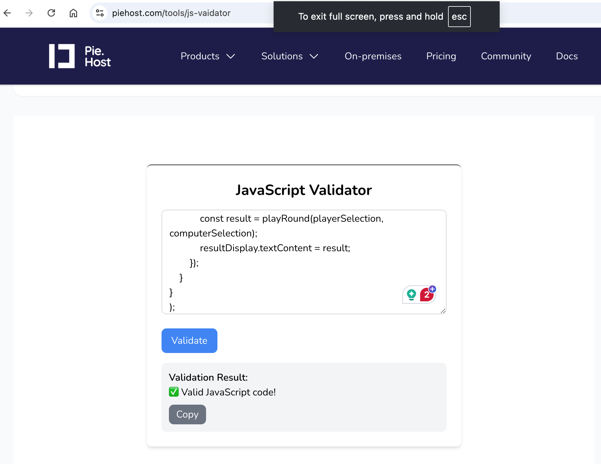

## 🎮 Rock Paper Scissors Lizard Spock!

- A fun, interactive web-based game inspired by The Big Bang Theory TV show and the original Rock Paper Scissors Lizard Spock concept by Sam Kass.
Built in Visual Studio using HTML, CSS, and JavaScript, this project brings a challenging twist to the classic Rock Paper Scissors game.

- Players compete against the computer, aiming to reach 15 points first to win. Each round tests your luck, logic, and strategy in this expanded five-choice game.

- Link to Game: https://brianjdowling101.github.io/Rock--Paper--Scissors--Lizard--Spock-/

## 🧭 User Stories

### External User Goals

- I want to play a quick, fun, and visually appealing game.

- I want clear instructions and feedback after every round.

- I want to see my score update dynamically as I play.

- I want the game to be responsive and work on mobile devices.

## Site Owner Goals

- To entertain users through an engaging and modern web game.

- To demonstrate front-end development and JavaScript logic skills.

- To deploy a well-tested, accessible, and visually appealing interactive website.

## 💻 Developer-Focused

- This project was created for the Dynamic Front-End Development Milestone to showcase:

-  Document Object Model (DOM) manipulation using JavaScript.

- Responsive layout using HTML5 and CSS3.

- Conditional logic and event handling.

- Accessibility and browser compatibility considerations.

- Version control and deployment with GitHub Pages.

## 🎨 Design Choices

- Theme: Inspired by The Big Bang Theory’s pop-culture humor.

- Color Scheme: Bright and contrasting colors to reflect the playful tone of the game.

- Typography: Clean sans-serif fonts for modern readability.

- Layout: Simple and centered design with clear buttons and score display.

- Feedback: Dynamic results display (“You Win!”, “You Lose!”, “It’s a Tie!”) and score counters.

## 🎮 Wireframe Summary: Rock, Paper, Scissors, Lizard, Spock Game

1. Overview

- A browser-based interactive game where players compete against the computer using the extended version of the classic Rock-Paper-Scissors rules — inspired by The Big Bang Theory TV show, where Sheldon Cooper popularized the “Rock, Paper, Scissors, Lizard, Spock” variation.

- The interface includes:

- A gameplay section

- A rules/instructions panel

- A feedback form

- Page Layout Structure

## Header Section

- Title: “Rock, Paper, Scissors, Lizard, Spock”

- Positioned at the top center of the page.

- Main Game Area

- Player Choice Buttons:

- 5 interactive icons or buttons: 🤘 Rock, 📄 Paper, ✌️ Scissors, 🦎 Lizard, 🖖 Spock

- Each button triggers a JavaScript function to record the player’s choice.

- Computer Choice Display:

- Area showing the computer’s randomly generated choice (e.g., “Computer chose Spock!”).

- Results Display / Scoreboard:

- Text area or card showing round result (“You Win!”, “You Lose!”, “It’s a Draw!”)

- Ongoing Score Counter: Player vs Computer

### 3. Rules Section

- Expandable or static box listing all rule interactions:

- Rock crushes Scissors and Lizard

- Paper covers Rock and disproves Spock

- Scissors cuts Paper and decapitates Lizard

- Lizard eats Paper and poisons Spock

- Spock smashes Scissors and vaporizes Rock

### 4. Feedback Form

- Section or modal allowing players to share feedback about the game. An arrow points down to the feedback form.

- Form Fields:

- Name:

- Email:

- Message:

- Submit Button triggers form validation and a thank-you message (e.g., “Thanks for your feedback!”)

## 🚀 Future Features

- Best of 5 or Timed Challenge modes.

- Sound effects and animations for win/loss events.

- Local storage for tracking high scores.

- Multiplayer mode or Boss difficulty levels. Take on different characther from the show.

- Enhanced Footer Bar — add themed social media icons, copyright mark, and maybe character quotes.

### Testing

## HTML, CSS & Javascript Validation

- W3C HTML Validator: All pages now pass validation.
Previously, three stray code errors were detected and have since been corrected. The site now validates with zero errors.

- W3C CSS Validator All pages now pass validation.
No errors or warnings were found. The CSS fully conforms to W3C standards. W3C CSS Validator:

- JavaScript code now passes the validator. Previously, there were 22 warnings reported. They have since been corrected. 

### Accessibility Testing

### Accessibility Improvements

- Designed for accessibility, it includes high-contrast colour schemes and readable fonts Lighthouse accessibility audit:

- Previously, the website had 3 contrast-related accessibility errors identified by the WAVE accessibility checker. These issues affected text readability, particularly in the headings.

-All 3 contrast issues have now been fully resolved. Text visibility and contrast have been improved across all areas to meet accessibility standards and ensure a better experience for all users.

## 🌐 Browser Compatibility

### Tested on:

- Google Chrome

- Mozilla Firefox

- Microsoft Edge

- Apple Safari

- All browsers displayed consistent performance and visuals.

### Responsive Testing

## 🚀 Deployment

- Deployed via GitHub Pages.

- Deployment Steps:

- Commit and push all project files to the GitHub repository.

- Navigate to Settings → Pages.

- Under “Source,” select main branch and /root folder.

- Click Save.

- The site is now live at the provided GitHub Pages URL.

- 🔗 Live Site: https://brianjdowling101.github.io/Rock--Paper--Scissors--Lizard--Spock-/

### Attribution

### Debugging

## 🧰 Technologies Used

- HTML5 – Game structure and semantic markup

- CSS3 – Styling, layout, and responsive design

- JavaScript (ES6) – Game logic, interactivity, and DOM manipulation

- Git & GitHub – Version control and repository management

- GitHub Pages – Deployment and live hosting

- Visual Studies– Initial design and layout planning

- IAmResponsive – Responsive design testing across devices

- Google Developer Tools (Lighthouse) – Accessibility, performance, and best practices testing

- WAVE – Web accessibility evaluation

- HTML & CSS Validators – W3C validation to ensure clean, standards-compliant code

- JavaScript Validators – JSHint and other tools to check JS syntax and quality

### Credits