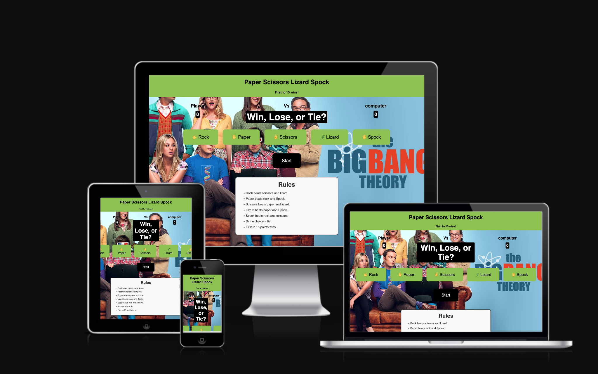

## 🎮 Rock Paper Scissors Lizard Spock!

- A fun, interactive web-based game inspired by The Big Bang Theory TV show and the original Rock Paper Scissors Lizard Spock concept by Sam Kass.
Built in Visual Studio using HTML, CSS, and JavaScript, this project brings a challenging twist to the classic Rock Paper Scissors game.

- Players compete against the computer, aiming to reach 15 points first to win. 

- Each round tests your luck, logic, and strategy in this expanded five-choice game.

## 🧭 User Stories

### External User Goals

- I want to play a quick, fun, and visually appealing game.

- I want clear instructions and feedback after every round.

- I want to see my score update dynamically as I play.

- I want the game to be responsive and work on mobile devices.

## Site Owner Goals

- To entertain users through an engaging and modern web game.

- To demonstrate front-end development and JavaScript logic skills.

- To deploy a well-tested, accessible, and visually appealing interactive website.

## 💻 Developer-Focused

- This project was created for the Dynamic Front-End Development Milestone to showcase:

-  Document Object Model (DOM) manipulation using JavaScript.

- Responsive layout using HTML5 and CSS3.

- Conditional logic and event handling.

- Accessibility and browser compatibility considerations.

- Version control and deployment with GitHub Pages.

### Design Choices

### Wireframes Summary

### Future Features

### Testing

## HTML, CSS & Javascript Validation

### Accessibility Testing

### Accessibility Improvements

### Browser Compatibility

### Responsive Testing

### Deployment

### Attribution

### Debugging

### Technologies Used

### Credits